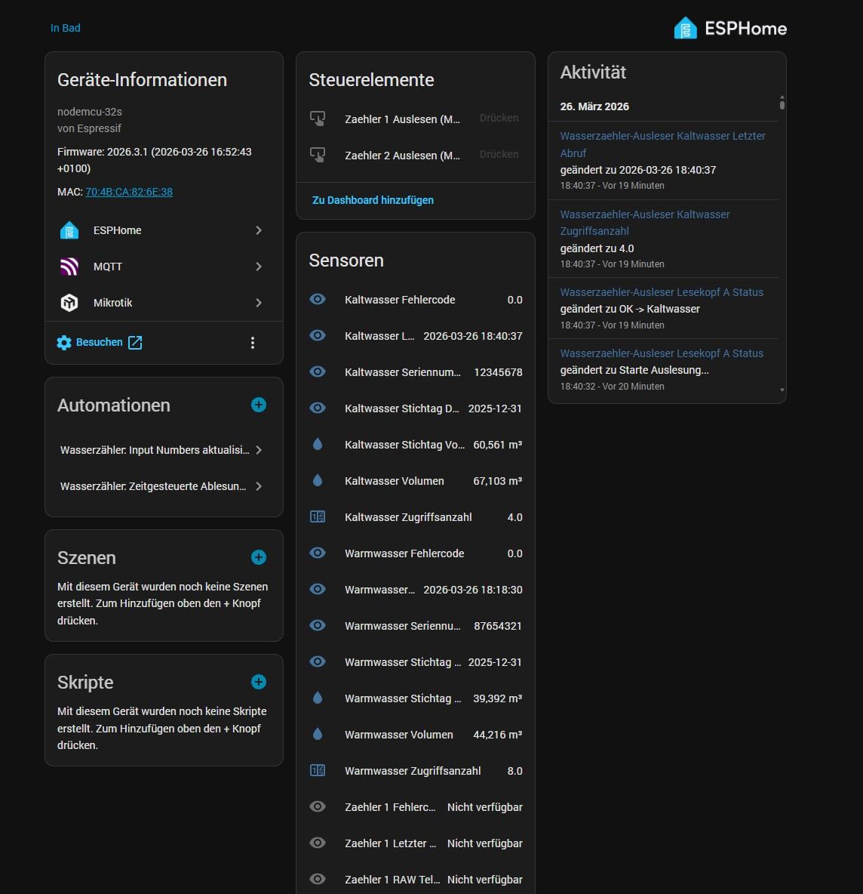
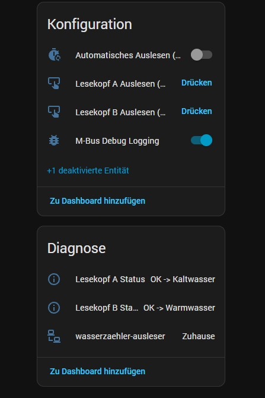
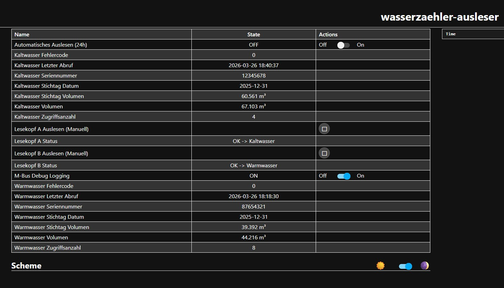

ESPHome M-Bus Wasserzähler Ausleser (Lorenz / Engelmann) Home Assistant
Dieses Projekt ermöglicht das automatische Auslesen von optischen M-Bus Wasserzählern (speziell getestet mit Lorenz / Engelmann WaterStar M) über ESPHome. Das Setup liest zwei Zähler (Kalt- und Warmwasser) parallel über einen einzigen ESP32 aus und integriert die Daten nahtlos und unverschlüsselt in Home Assistant.

📖 Warum dieses Projekt? (Die Vorgeschichte)
Dieses Projekt entstand aus einer klassischen Smart-Home-Frustration: Die Hausverwaltung wollte mir den AES-Schlüssel für die Funk-Schnittstelle (wM-Bus) meiner Wasserzähler nicht geben. Da ich die Zählerstände trotzdem in meinem Home Assistant haben wollte, musste eine Alternative her. Die Lösung: Wir greifen die Daten einfach direkt, lokal und unverschlüsselt über die optische Infrarot-Schnittstelle der Zähler ab!

⚠️ Wichtiger Hinweis zur Batterielebensdauer
Der Wasserzähler wird über eine fest verbaute interne Batterie betrieben (ausgelegt auf ca. 10 Jahre im Standardbetrieb). Jeder optische Abruf (Wakeup + Datenübertragung) verbraucht zusätzliche Energie. Aktuell ist noch nicht bekannt, wie stark regelmäßige Auslesungen die Lebensdauer der Batterie exakt verkürzen. Daher die dringende Empfehlung: Lest den Zähler nicht sekündlich oder minütlich aus! Nutzt clevere Automationen in Home Assistant, um die Daten nur dann abzurufen, wenn sie wirklich benötigt werden (z. B. 1–2 mal am Tag, oder wenn die Waschmaschine fertig ist).

📈 Update folgt: Ich werde demnächst einen Stresstest an einem separaten Testzähler durchführen und ihn per Skript so lange ununterbrochen abfragen, bis die Batterie aufgibt. Sobald es hierzu Erfahrungswerte gibt, werde ich das Readme aktualisieren! Bis dahin gilt: Nutzung auf eigene Gefahr.

✨ Besonderes Feature: Dynamische Zuweisung
Egal, welchen Lesekopf du an welchen Zähler hängst: Der Code erkennt M-Bus-Seriennummer direkt aus dem Header des Telegramms und sortiert die Werte automatisch in die korrekten Home Assistant Sensoren (Kalt- oder Warmwasser) ein. Ein versehentliches Vertauschen der Werte beim Umstecken der Hardware ist somit komplett ausgeschlossen!

🛠 Hardware-Anforderungen
1x ESP32 NodeMCU-32S 

2x TTL Hichi IR Leseköpfe (Optische Infrarot-Köpfe)

Ein 3D-gedrucktes Gehäuse/Fadenkreuz zur exakten Positionierung der Leseköpfe auf dem Zählerglas.

⚙️ Installation & Setup
Trage ganz oben in der wasserzaehler-ausleser.yaml unter substitutions: deine WLAN-Daten sowie die beiden Seriennummern deiner Wasserzähler ein (zu finden aufgedruckt auf den Zählern).

Flashe den Code via ESPHome auf deinen ESP32.

Der ESP32 taucht nun automatisch in Home Assistant auf.

Tipp für Home Assistant: Anstatt stumpf nach Zeit auszulesen, erstelle eine Automation in Home Assistant, die den ESP32-Button (button.lesekopf_a_auslesen_manuell) drückt, wenn ein Ereignis eintritt (z. B. "Waschmaschine fertig"). So schonst du die Batterie des Wasserzählers massiv!
Hinweis: Lasse zwischen dem Auslesen von Kopf A und Kopf B in deinen Automationen immer eine kurze Pause, damit sich die seriellen Schnittstellen nicht überschneiden.

📊 Ausgelesene Werte
Der ESP32 parst das rohe M-Bus-Telegramm und stellt folgende Entitäten in Home Assistant bereit:
* Aktuelles Volumen (m³)
* Stichtag Datum & Stichtag Volumen
* Interne Zugriffsanzahl des Zählers
* Fehlercodes
* Raw-Telegramm (Hex) für Debugging-Zwecke

## 📸 Screenshots

### Home Assistant

### ESPHome Webinterface

